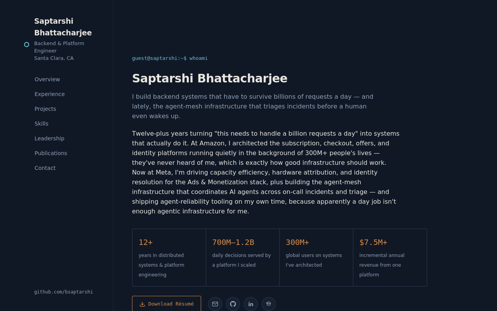

# Saptarshi Bhattacharjee — Personal Site

Backend & platform engineer portfolio — distributed systems, capacity attribution, and
agentic AI infrastructure. Live at **[bsaptarshi.github.io](https://bsaptarshi.github.io)**.

Built as a single static page — no framework, no build step, no dependencies beyond
two Google Fonts. Just `index.html` and `style.css`.

## Contents

- Experience — Meta, Amazon, Applied Research Works
- Independent projects — agentbelt, ladon-ml, and an early-stage agentic
  version-control system
- Open-source contributions — Google Guava, OpenAI Java SDK
- Technical skills, publications, education
- Downloadable résumé (`resume.pdf`)

---

## Local development / editing notes

Everything is in `index.html` — content and structure are inline, so update text
directly there. Colors, spacing, and typography live in `style.css`.

- `.stat-row` in the hero holds the four "at a glance" metrics.
- `.timeline` holds each job — copy a `.role` block to add a new one.
- `.project-grid` holds the Independent Projects cards.
- `.skills-grid` holds the skills table.
- `.social-row` holds the circular icon links (email/GitHub/LinkedIn/Scholar) — copy
  an `<a>` block and swap the SVG + URL to add another platform.

**Deploying changes**: this repo *is* the live site (GitHub Pages serves directly
from `main` / root) — commit and push, and the site updates within a minute or two.
No separate build/deploy step.

**Notes:**
- Fonts (IBM Plex Sans / IBM Plex Mono) load from Google Fonts via `<link>` tags in
  the `<head>` — no local font files needed.
- Phone number is intentionally omitted from the public page (email + LinkedIn +
  GitHub + Scholar only) since this page is indexed by search engines.
- `resume.pdf` is the file linked from the hero's "Download Résumé" button. Replace
  it (same filename) whenever the résumé updates — no HTML changes needed.
- No JavaScript framework — the only script is a ~15-line scroll listener that
  highlights the active section in the sidebar nav.
